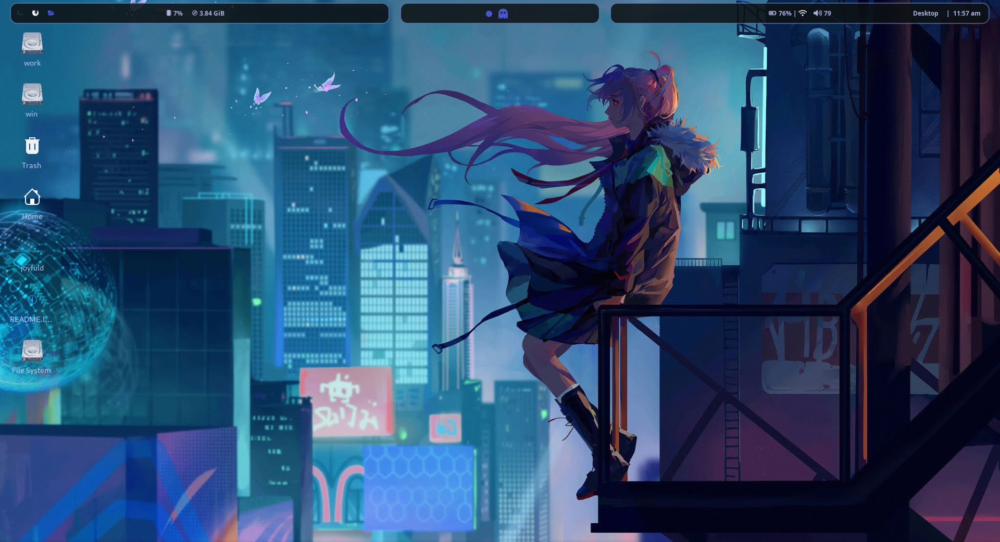

# Repository Overview
=======================

This repository contains my personal Linux XFCE dotfiles, featuring a customized Polybar configuration, Lavanda-Dark-Compact-Tokyonight theme, and Vortex-Dark-Icons. The goal of this repository is to provide a clean and minimalistic XFCE setup, with a focus on simplicity and ease of use.

# Contents
============

* XFCE settings and configurations
* Polybar configuration files
* Lavanda-Dark-Compact-Tokyonight theme
* Vortex-Dark-Icons (compressed in tar.xz format)
* ncmpcpp configuration files
* dunst and mpd configuration files

<!--  -->
 <h2>
	

		
<b>Screenshots</b> 

  		
 	

 </h2>

### Polybar's

<!-- ||
|---| -->

		
<b>Themes</b> 

  		

 

# Themes
==========

* **Lavanda-Dark-Compact-Tokyonight**: A dark, compact theme inspired by the Tokyo Night theme.
<!-- * **Polybar Themes**:
	+ **Theme 1**: [Theme 1 Description]
	+ **Theme 2**: [Theme 2 Description]
	+ **Theme 3**: [Theme 3 Description] -->

# Icons
=========

* **Vortex-Dark-Icons**: A set of dark icons in tar.xz format.

# Polybar Configuration
=========================

* My Polybar configuration features a minimalistic layout with a focus on simplicity and ease of use. I'll update this section soon with more details about my Polybar settings and plugins.

# Dependencies
===============

* Fonts:
	+ Font Awesome
	+ Material Icons
	+ Isokeva Fonts
* Polybar and its dependencies:
	+ polybar
	+ mpc
* ncmpcpp and its dependencies:
	+ dunst
	+ mpd
	+ mpc
* Icons:
	+ Vortex-Dark-Icons (compressed in tar.xz format)

# Installation and Usage
==========================

1. Clone this repository to your local machine using `git clone https://github.com/Rajkumar-justcoder/dotfiles-xfce.git`
2. Extract the Vortex-Dark-Icons tar.xz file to your desired icon directory
3. Install the required dependencies, including fonts, polybar, mpc, dunst, and mpd
4. Copy the XFCE settings and configurations to your XFCE configuration directory
5. Restart your XFCE session or reboot your machine to apply the changes

# License
==========

This repository is released under the [MIT License](https://opensource.org/licenses/MIT). Feel free to use, modify, and distribute the contents of this repository as you see fit.

# Acknowledgments
================

* Thanks to the original authors of the Lavanda-Dark-Compact-Tokyonight theme and Vortex-Dark-Icons for their hard work and dedication.
* Thanks to the developers of polybar, mpc, dunst, and mpd for their amazing software.